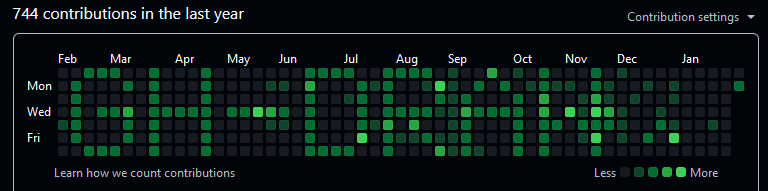

# GitHub Contributions Graph Drawer



This script allows you to "draw" text on your GitHub contributions graph by creating commits with specific dates in the past. Each commit marks a contribution on the GitHub calendar, thus forming pixel-like letters over time.

---

## How It Works

1. **Matrix Representation**  
   Each character (letter, digit, or symbol) is defined as a 7×5 matrix of characters (`#` for a “filled pixel” and ` ` [space] for an “empty pixel”).  
   * The script uses a dictionary (`LETTER_MAP`) to store the pixel representation of each supported character.

2. **Converting a Word to a Matrix**  
   When you provide a word (e.g., `"HELLO"`), the script builds a 7-row matrix spanning multiple columns. Each letter is 5 columns wide, and there is 1 blank column separating letters.

3. **Mapping Matrix to Dates**  
   - By default, the script starts at a given date (52 weeks ago if not specified, or a custom date passed via `--start-date`).  
   - Each column of the matrix corresponds to a week; each row corresponds to a day (from Sunday to Saturday).  
   - If the script finds a `#` in row `r`, column `c`, it means a commit (or multiple commits) will be made on the date `start_date + (c*7 + r)` days.

4. **Commit Intensity (Mode)**  
   - **max**: Creates 5 commits on that day. This usually shows up as the darkest green in GitHub’s contribution graph.  
   - **random**: Creates a random number of commits from 1 to 5, still visible, but variable.

5. **Forcing Dates**  
   - The script uses the `--date` parameter in `git commit` to backdate commits.  
   - **Warning**: This is a form of rewriting history or artificially inflating commit counts. Make sure to use it responsibly and within GitHub’s Terms of Service.

---

## Usage

1. **Set up a New Git Repository**  
   - It is recommended to initialize a brand-new repository for this purpose (or clone an empty one).  
   - This avoids polluting your real project history.

2. **Install Dependencies**  
   - Make sure you have [Git](https://git-scm.com/) installed and properly configured (username, email, etc.).  
   - The script requires Python 3.x.

3. **Clone or Create a Repo and Place the Script**  
   ```bash
   git clone <URL_of_your_new_repo>
   cd <your_new_repo>
   # Place githubdraw.py in this repo folder.
   ```

4. **Run the Script**
    ```bash
    python githubdraw.py "HELLO" --mode max
    ```
    - This will create multiple commits, using dates in the past, so that the GitHub calendar will display the “HELLO” pattern over the weeks.

5. **Optional Parameters**
    - `--mode`: Choose between "max" (5 commits per marked day) or "random" (1–5 commits).
    - `--start-date`: Specify a custom start date in YYYY-MM-DD format. If omitted, the script defaults to 52 weeks ago from today.

6. **Push to GitHub**
    ```bash
    git push origin main
    ```
    - After the commits are created locally, push them to the remote repository.
    - Wait a few minutes and check your GitHub profile to see the new pattern appear on your contributions graph.

## Example Commands

```bash
# 1) Draw "TEST" in maximum intensity mode
python githubdraw.py "TEST" --mode max

# 2) Draw "DATA" with random commits (1-5)
python githubdraw.py "DATA" --mode random

# 3) Specify a custom start date
python githubdraw.py "HELLO" --mode max --start-date 2024-02-01
```

## Caution & Disclaimer

- Using backdated commits to modify your GitHub contribution graph can be considered a “hack” of your GitHub history.
- Always comply with GitHub’s Terms of Service and use such techniques responsibly.
- This script is provided for educational and illustrative purposes. Use at your own risk.
